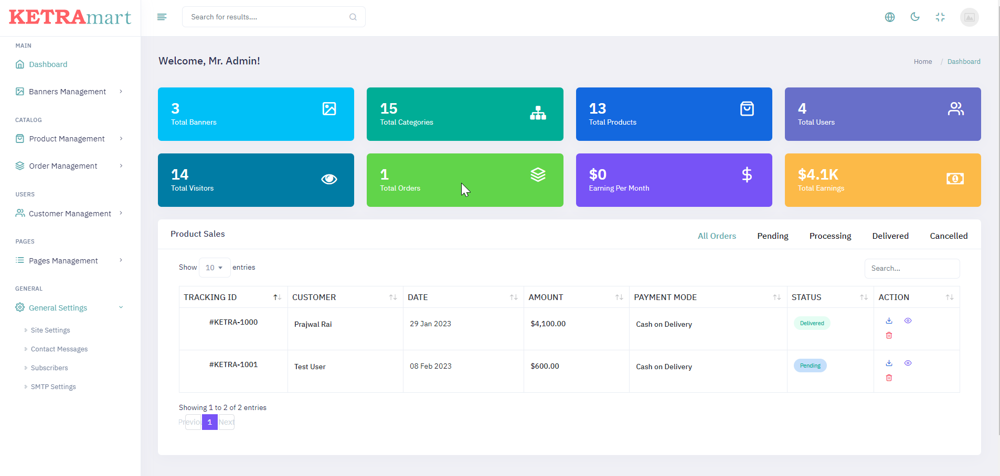
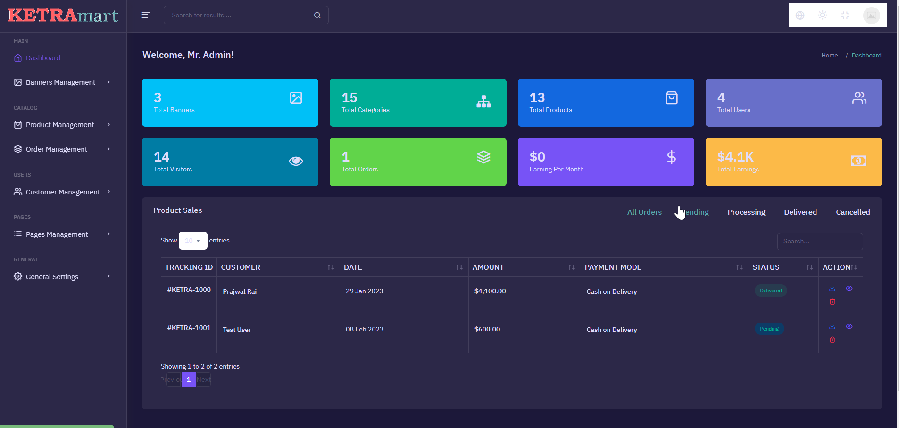
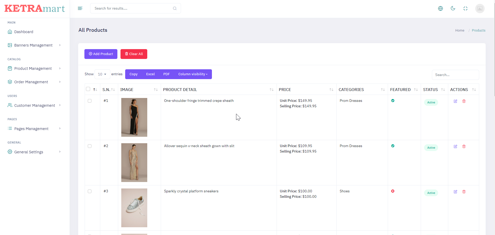
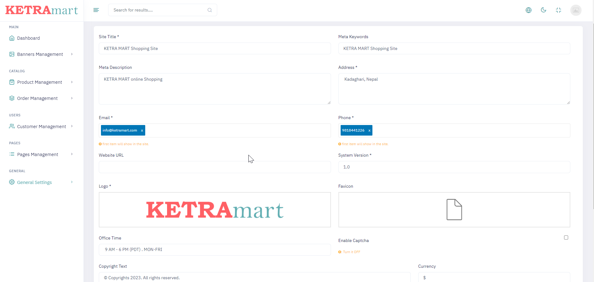

## APP FEATURES :

#### DEMO URL
https://free.ketramart.com

https://ketramart.com

#### ADMIN LOGIN
https://free.ketramart.com/admin

https://ketramart.com/admin

#### FEATURES
https://features.ketramart.com

##  FRONT-END 

- Responsive Layout
- Shopping Cart, Wishlist
- Product attributes: price, stock, size...
- Upload manager: banner, images,..
- SEO support
- Newsletter management
- Contact forms with message,
- Related Products, Recommendations for you in our categories
- A Product search form
- User Profile Management

many more......

## ADMIN 


- Product manager
- Custom Media manager 
- Banner manager
- Order management
- Category management
- User Management
- System config: email setting, info shop, maintain status,...
- Contact Messages, Subscriber management
- Profile Settings

Many more....


### Set up :

- Clone the repo and cd into it
- In your terminal ```composer install```
- Rename or copy ```.env.example``` file to ``.env``
- php artisan key:generate
- Set your database credentials in your ```.env``` file
- Import db file(```database/ketra_mart.sql```) into your database (```mysql,sql```)
- run command:-  ```php artisan storage:link```
- ```php artisan serve``` or use virtual host
- Visit ```localhost:8000``` in your browser
- Visit /admin if you want to access the admin panel. Admin Email/Password: ```admin@gmail.com```/```admin123```. 


  ### Screenshots-Demo
  <kbd></kbd><br>
  
  <kbd></kbd><br>
  
 <kbd></kbd><br>
 
 <kbd></kbd><br>
 
  <kbd></kbd><br>
  
  <kbd></kbd><br>
   
  <kbd></kbd><br>
    
  <kbd></kbd><br>

 ## Author Contact
  Contact me with any questions!<br>

  Email: dhruvabhattacharya130102@gmail.com

  ## License
  This project is [MIT](https://choosealicense.com/licenses/mit/) licensed.<br />
  
<hr>
  Copyright © 2023 [Dhruva Bhattacharya.](https://dhruvabhattacharya.github.io/#/)
  
<p style="text-align:center">Thank You so much for your time !!!</p>
